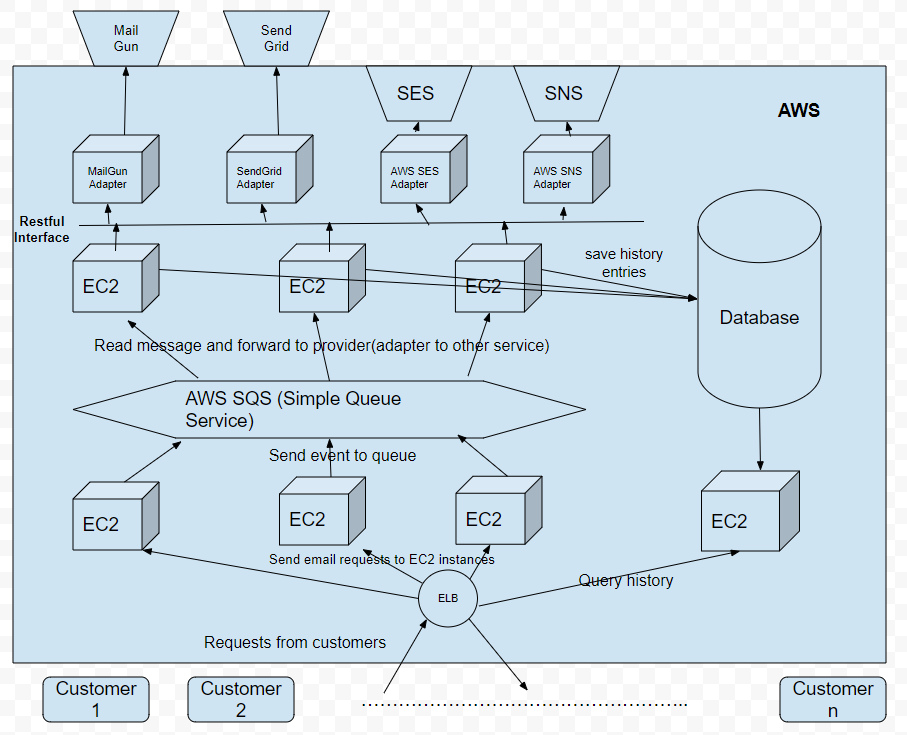

# What it is

This is a service that accepts the necessary information and sends emails.

# Design

There are several modules:

- Message Receiver : receive user request, validation, then put request in queue
- Message Consumer : consumer message in queue, then send to provider adapter

- Provider Adapter : send message to third party email service like mailgun

# How it works

Please look at this component diagram I

# Todo

- Restful API should return different status code instead of 200 if parameter is wrong, or JMS is done.
- 100% coverage for unit test/integration test
- Application Level Load Balancing
- Security settings to reduce attack risk
- NoSQL support for saving email delivery history
- Advanced 3rd party service provider switch strategy based on service health check and load balancing
- JMX support for ProviderHelper, so that we can add more service provider in the runtime, without stop server or deploy new build.

# Restful API 

Please check out the restful_api.md. 

# How to build it

You need install following dependencies:

- jdk
- maven
- activemq

Run following command to build it

    $cd sitemind_refactor 
    $mvn package -DskipTests

Start Message Service at http://localhost:8080

    $java -jar message-service/target/message-service-1.0.jar
    
Start Mailgun provider adapter at http://localhost:8081 (Will register itself to Message Service on start)
    
    $java -jar provider-mailgun/target/provider-mailgun-1.0.jar
     
Start Sendgrid provider adapter at http://localhost:8082 (Will register itself to Message Service on start)
    
    $java -jar provider-sendgrid/target/provider-sendgrid-1.0.jar
